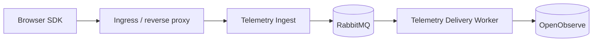

# Frontend Observability

[](https://github.com/Asperant/frontend-observability/actions/workflows/ci.yml)
[](LICENSE)
[](.node-version)

Installable frontend observability platform for browser applications: a zero-dependency browser SDK, a queue-backed ingest/delivery pipeline, and an OpenObserve-based analytics backend — deployable as a Docker reference lab or bare Linux/systemd services.

## Install

```sh
npm install @frontend-observability/browser-observability
```

## Prerequisites (for working on this repo)

- Node.js `24.18.0` (see `.node-version` / `engines.node`)
- pnpm `11.x`

## Public Browser API

`@frontend-observability/browser-observability` exposes exactly one ESM entry point:

```js
import {
  getObservabilityStatus,
  initializeObservability,
  recordAction,
  recordError,
  setTrackingConsent,
  shutdownObservability,
} from "@frontend-observability/browser-observability";
```

Public APIs never throw. They return outcome/status objects with reason codes.

## Browser-Facing Endpoints

- `POST /rum/v1/default/rum`
- `POST /rum/v1/default/logs`
- `GET /observability/config.json`
- `GET /observability/control.json`

No replay, OpenObserve management/search, RabbitMQ, or operator write endpoint is browser-facing.

## Product Flow



Browser -> ingress/reverse proxy -> Telemetry Ingest -> RabbitMQ -> Telemetry Delivery Worker -> OpenObserve

Telemetry must pass through the queue-backed delivery path; there is no browser persistent queue.

## Repository Layout

| Path                                    | Description                                    |
| --------------------------------------- | ---------------------------------------------- |
| `apps/telemetry-ingest`                 | Browser admission service.                     |
| `apps/telemetry-delivery-worker`        | RabbitMQ to OpenObserve delivery worker.       |
| `apps/observability-control-plane`      | Read-only runtime config/control HTTP service. |
| `apps/session-metadata-sync`            | Metadata-only session sync service.            |
| `packages/browser-observability`        | Installable browser package.                   |
| `packages/telemetry-delivery-core`      | Shared ingest/delivery core.                   |
| `packages/observability-contracts`      | JSON schemas and shared validators.            |
| `tests/fixtures/apps/browser-app`       | Reference browser fixture app.                 |
| `tests/fixtures/apps/http-test-service` | Reference HTTP fixture service.                |

## Core Commands

- `pnpm install --frozen-lockfile`
- `pnpm run format:check`
- `pnpm run lint`
- `pnpm run build` (required before `pnpm run test`: contract tests inspect the built `dist/`)
- `pnpm run test`
- `pnpm run package:audit`
- `pnpm run test:consumer`
- `pnpm run test:durable-delivery`

The 3650 second durable-outage soak evidence is recorded as a historical acceptance record (`evidence/acceptance/durable-outage-soak.json`) and is not rerun for normal product verification. The raw test artifact from that run was never committed to this repository; the manifest documents the previously-reported result and its provenance rather than claiming the raw evidence is preserved here.

## Documentation

- [`docs/architecture.md`](docs/architecture.md): system architecture and component responsibilities.
- [`docs/integration-guide.md`](docs/integration-guide.md): how to integrate the browser package into an app.
- [`docs/security-model.md`](docs/security-model.md): data handling, sanitization, and privacy guarantees.
- [`docs/operations-runbook.md`](docs/operations-runbook.md): running and operating the reference lab environment.
- [`docs/production-handoff.md`](docs/production-handoff.md): checklist for taking this to production.

## License

MIT — see [`LICENSE`](LICENSE).
